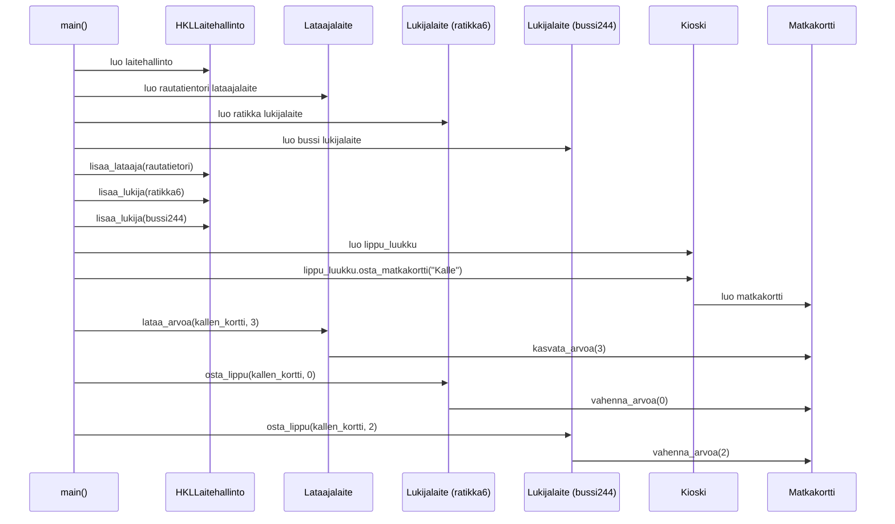

```mermaid
sequenceDiagram
    participant Main as main()
    participant HKL as HKLLaitehallinto
    participant Lataaja as Lataajalaite
    participant Ratikka as Lukijalaite (ratikka6)
    participant Bussi as Lukijalaite (bussi244)
    participant Kioski
    participant Kortti as Matkakortti

    Main->>HKL: luo laitehallinto
    Main->>Lataaja: luo rautatientori lataajalaite
    Main->>Ratikka: luo ratikka lukijalaite
    Main->>Bussi: luo bussi lukijalaite
		Main->>HKL: lisaa_lataaja(rautatietori)
		Main->>HKL: lisaa_lukija(ratikka6)
		Main->>HKL: lisaa_lukija(bussi244)
		Main->>Kioski: luo lippu_luukku
		Main->>Kioski: lippu_luukku.osta_matkakortti("Kalle")
		Kioski->>Kortti: luo matkakortti
		Main->>Lataaja: lataa_arvoa(kallen_kortti, 3)
		Lataaja->>Kortti: kasvata_arvoa(3)
		Main->>Ratikka: osta_lippu(kallen_kortti, 0)
		Ratikka->>Kortti: vahenna_arvoa(0)
		Main->>Bussi: osta_lippu(kallen_kortti, 2)
		Bussi->>Kortti: vahenna_arvoa(2)
	
```
